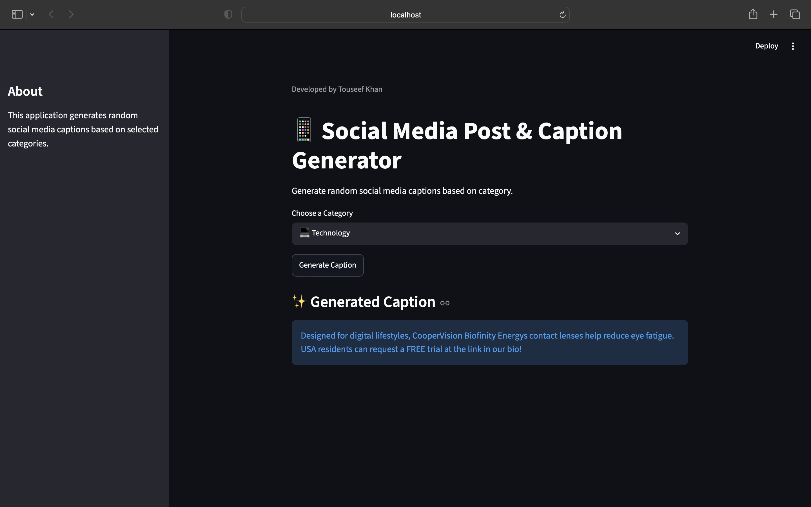

# Social Media Post & Caption Generator

A category-based social media caption retrieval application built using Python, Pandas, JSON, and Streamlit.

## Project Overview

This project provides a simple web-based application for retrieving social media captions based on a user-selected category.

The application uses an influencer social media dataset containing posts and captions from four categories:

- Beauty
- Fitness
- Food
- Technology

The user selects a category, and the application retrieves captions associated with that category and randomly selects one caption to display.

> **Note:** The current application retrieves existing captions from the dataset rather than generating new captions using an AI model.

## Technologies Used

- Python
- Pandas
- JSON
- Streamlit
- Google Colab

## Features

- JSON dataset loading and exploration
- Dataset structure analysis
- Category-wise caption analysis
- Category mapping
- Caption extraction from influencer posts
- Random caption selection
- Interactive category selection
- Interactive web interface using Streamlit

## Dataset

The dataset was obtained from Kaggle and contains influencer posts organized into different categories.

### Dataset Categories

| Category | Number of Captions |
|----------|-------------------:|
| Beauty | 44 |
| Fitness | 76 |
| Food | 99 |
| Technology | 75 |

Food contains the highest number of captions, while Beauty contains the lowest number of captions.

The dataset was analyzed before implementing the retrieval functionality to understand its structure and organization.

## How It Works

The application follows a simple retrieval-based workflow:

1. The JSON dataset is loaded using Pandas.
2. The dataset structure is inspected and analyzed.
3. The user selects a category through the Streamlit interface.
4. The selected category is mapped to its corresponding data.
5. Captions from influencers belonging to that category are collected.
6. One caption is randomly selected from the collected captions.
7. The selected caption is displayed through the web interface.

### Workflow

```text
User selects category
        ↓
Category is mapped
        ↓
Relevant influencer data is accessed
        ↓
Captions are collected
        ↓
Random caption is selected
        ↓
Caption displayed in Streamlit
```

## Project Structure

```text
Social-Media-Post-Caption-Generator/
│
├── app.py
├── instagram-posts.json
├── Social_Media_Post_Caption_Generator.ipynb
├── Social_Media_Post_Caption_Generator.pdf
├── app_screenshot.png
└── README.md
```

## Streamlit Application

The project includes an interactive Streamlit interface that allows users to select a category and retrieve a random caption.

The application provides a simple interface so that users do not need to interact directly with the Python code.

## How to Run

### 1. Clone the Repository

```bash
git clone https://github.com/touseeftariqkhan/Social-Media-Post-Caption-Generator.git
```

### 2. Navigate to the Project Folder

```bash
cd Social-Media-Post-Caption-Generator
```

### 3. Install the Required Libraries

```bash
pip install pandas streamlit
```

### 4. Run the Streamlit Application

```bash
streamlit run app.py
```

### 5. Open the Application

Streamlit will provide a local URL in the terminal. Open that URL in your browser to use the application.

## Application Screenshot



## Learning Outcomes

Through this project, I gained practical experience with:

- Working with JSON datasets
- Loading and exploring datasets using Pandas
- Understanding rows, columns, and nested data structures
- Extracting information from a real-world dataset
- Working with Python lists, dictionaries, loops, and functions
- Building an interactive interface using Streamlit
- Connecting data-processing logic with a web interface
- Testing the application with different categories

## Challenges

One of the main challenges was understanding the nested structure of the JSON dataset and locating the influencer posts and captions within the data.

Another challenge was mapping the selected category to the appropriate dataset entries so that only relevant captions were retrieved.

## Future Improvements

- Integrate an actual generative AI or LLM-based model for generating original captions
- Add more social media categories
- Add keyword-based caption filtering
- Add multilingual caption support
- Allow users to save favorite captions
- Deploy the application for wider accessibility

## Author

**Touseef Khan**

B.Tech Computer Science & Engineering  
Amity University Uttar Pradesh

### Internship Project

IBM Career Opportunity Program Internship
